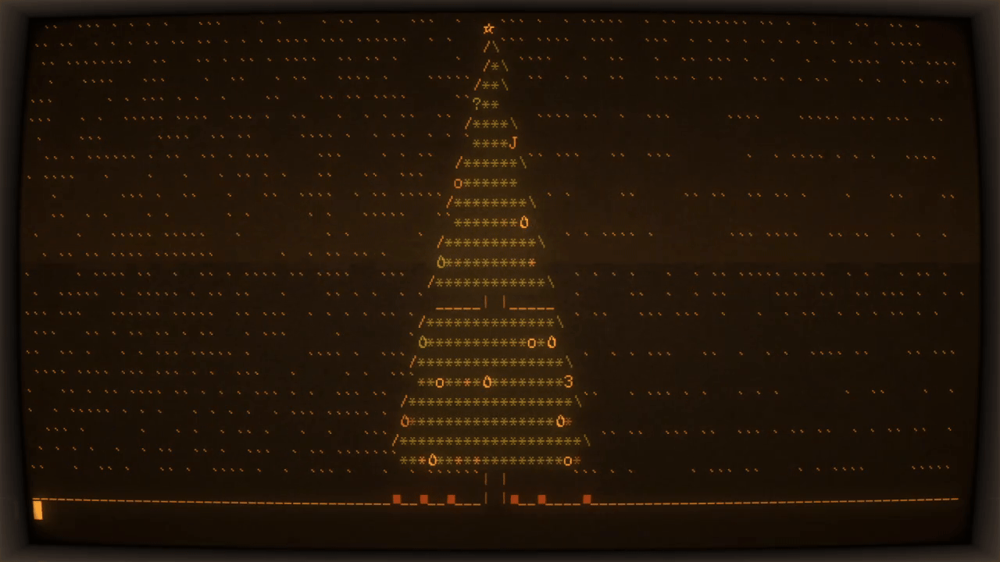

Tree.



Enter command line arguments in this order: time interval, the width of the tree, and size padding on the left and right
all are optional, but if you want to provide width or padding, the ones before in the list also have to be provided
(eg, to provide width, you need to also give the argument time interval)

To run the program, download the executable for your operating system in the latest release (No extension for Linux, Tree.exe for Windows)
For help, you can pass an argument containing the letter "h" to the program first.

To build from source, simply run `cargo build --release`, as it is a standard Rust program.

In order to get the small binary that I distribute, run this command.


```cargo build -Z build-std=std,panic_abort -Z build-std-features=panic_immediate_abort --target x86_64-unknown-linux-gnu --release```
